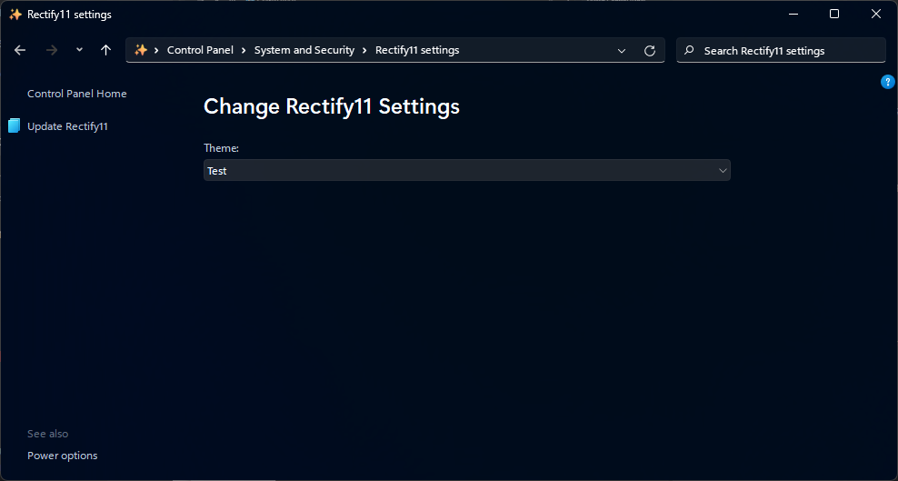

    
  <b>Rectify Control Panel</b> 
  The first control panel applet not made by Microsoft to use Microsoft's DirectUI library  
  <a href="./Rectify11CPL">Source Code</a> | 
  <a href="[https://](https://discord.gg/rectify11-community-1077324213142175744)">Discord</a> | 
    
    

## Usage
Build the Rectify11CPL project, and then register it using regsrv32 inside of admin command prompt. Make sure to restart explorer.

## Libaries used
https://github.com/seven-mile/dui70 - DirectUI library
https://github.com/namazso/SecureUxTheme - For setting theme